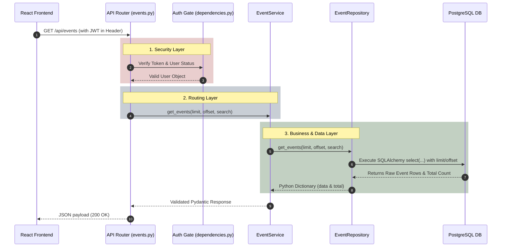
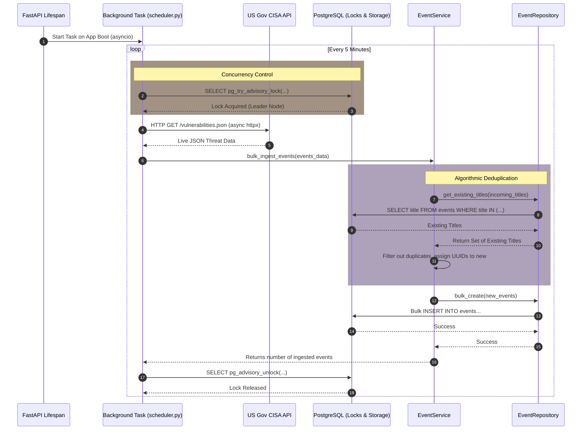
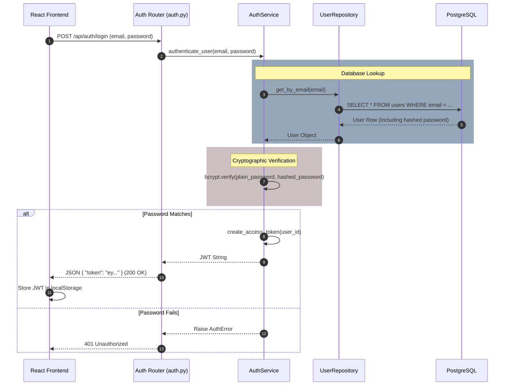

# PenguWave System Flow Diagrams

This document contains visual diagrams mapping out the critical communication paths between the different layers of the PenguWave architecture. You can view these diagrams in any Markdown viewer that supports Mermaid.js (such as GitHub, VS Code, or modern IDEs).

---

## 1. User API Request Lifecycle (Fetching Events)

This diagram illustrates the "Clean Architecture" flow. Notice how the request moves strictly through defined layers (Frontend -> Router -> Service -> Repository -> Database) without skipping steps.

---

## 2. Background Telemetry Ingestion Flow

This diagram illustrates how the asynchronous background task runs silently alongside the main web server, guaranteeing deduplication and avoiding concurrency collisions using PostgreSQL locks.

---

## 3. Stateless Authentication & Login Flow

This diagram illustrates the secure login process using bcrypt hashing and JSON Web Tokens (JWT). Notice that the database is only queried once during login; after that, the stateless JWT carries the proof of identity.

---

## 4. Automated CI/CD & AI Workflow (GitHub Actions)

This demonstrates the strict quality gates enforced by GitHub Actions and how AI (like myself) interacts with the repository securely.

```mermaid
sequenceDiagram
    autonumber
    participant Dev as AI Agent / Developer
    participant Git as Local Git
    participant GitHub as GitHub Repository
    participant Actions as GitHub Actions (CI)
    
    Dev->>Git: Write Code & Commit
    Dev->>Git: git push origin branch_name
    Git->>GitHub: Push Trigger
    
    rect rgb(50, 50, 50)
    Note over GitHub,Actions: Automated Quality Gates
    GitHub->>Actions: Trigger CI Pipeline
    Actions->>Actions: Run ruff check (Linting)
    Actions->>Actions: Run mypy (Strict Typing)
    Actions->>Actions: Run ESLint (Frontend)
    Actions->>Actions: Run Pytest (Unit/Integration Tests)
    end
    
    alt All Tests Pass
        Actions-->>GitHub: ✅ Status Checks Passed
        GitHub-->>Dev: Branch is safe to merge
    else Any Test Fails
        Actions-->>GitHub: ❌ Status Checks Failed
        GitHub-->>Dev: Block Merge & Request Fixes
    end
```

